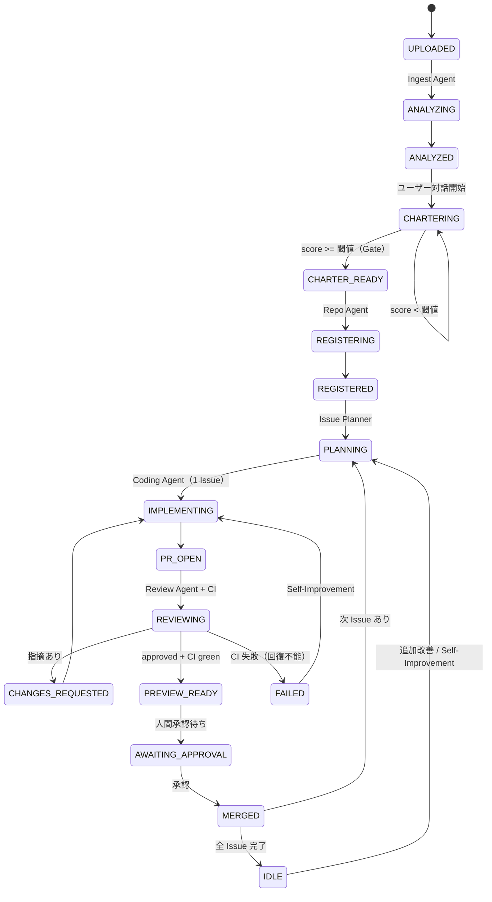

# PoC Renovater — 設計ドキュメント（叩き台 v0.3）

- 最終更新: 2026-06-21
- ステータス: Draft（実装着手前のレビュー用 / Claude Code への引き渡し用）
- 対象読者: 開発者本人 + Claude Code（実装エージェント）
- v0.2 の変更: §16 の主要な未確定事項を確定（言語=Python、Coding エンジン、Agent 実行場所、PoC 隔離、アップロード方式、モデル/リージョン、GitHub org）。詳細は §1.4。
- v0.3 の変更: preview 同時数上限=2、Gemini リージョン方針（東京→アジア→global の優先順）、GitHub App を org owner 権限で作成、を確定（§1.4 / §4.1 / §10.1 / §14.3 / §15 / §16）。
- 補助ドキュメント: コードレベルの実装規約は [`docs/app-architecture.md`](app-architecture.md)、技術スタック検証フェーズは [`docs/tech-stack-validation.md`](tech-stack-validation.md)、領域別の設計ポリシーは [`docs/policy/`](policy/)（backend-architecture / api-schema / frontend / ux-design / a2a-protocol / sandbox / infra / templates）。

> このドキュメントは「Claude Code にフェーズ単位で自走実装させる」ことを目的に、What（何を作るか）と各コンポーネント間の Contract（契約）を確定させるための叩き台です。
> ADK / Vertex AI / Cloud Run などフレームワーク固有の最新 API は変化が速いため、本書では**設計レベルの仕様**を確定し、SDK の正確な呼び出しは実装時に公式ドキュメント（後述の Context7 MCP など）で確認する方針とします。

---

## 0. このドキュメントの使い方（Claude Code への引き渡し）

1. このファイルをリポジトリに `docs/DESIGN.md` として配置する。
2. リポジトリ直下に `CLAUDE.md`（§13 にテンプレート）を作り、規約・コマンド・本書への参照を書く。
3. §12 の実装フェーズを**上から順に** Claude Code に依頼する。1 フェーズ = 1 PR を基本とする。
4. 各フェーズの「完了条件（DoD）」を満たすまで次に進まない。これは PoC Renovater 自身のガードレール思想（方針が固まるまで先に進まない）と同じ。

---

## 1. スコープと前提

### 1.1 ゴール（MVP）
ローカルでしか動かない Vibe Coding 製 PoC を、(a) 改善方針を固め、(b) GitHub リポジトリ化し、(c) Issue/PR ベースで AI が段階改善し、(d) Cloud Run preview で動作確認できる状態にする。デモシナリオ（§11）を一気通貫で通すことが MVP の合格ライン。

### 1.2 確定している前提
- **クラウド**: Google Cloud に寄せる。
- **コード管理**: 当面 GitHub（GitHub App 経由）。Issue/PR/レビュー/Actions の成熟度・コスト・デモ訴求の観点で MVP に最適。GCP ネイティブの `Secure Source Manager` は将来のエンタープライズ要件（データレジデンシ等）が出た時のオプションとし、Git 操作と Issue/PR を抽象化レイヤーで包んで乗り換え可能にしておく（§10.4）。
- **コスト感度**: 高い（GCP クレジット前提）。固定費の高いマネージドサービスは MVP では避ける。

### 1.3 非スコープ（MVP では作らない）
- 認証付き本番デプロイ、独自ドメイン、Cloud SQL/Firestore への本格 DB 移行支援
- 複数 PoC のダッシュボード分析、Slack 通知、コスト見積もり
- マルチテナント本格対応（MVP は単一 org / 単一プロジェクト前提）

### 1.4 確定した主要判断（v0.2）
| 項目 | 決定 |
|---|---|
| バックエンド/エージェント言語 | **Python**（フロントは Next.js/TS） |
| Coding Agent エンジン | **既定 = ADK + Gemini 3 Pro**。`claude -p`（Claude Code headless）を**オプションで選択可**（`CODING_ENGINE` で切替、§8.1） |
| エージェント実行場所 | **MVP = Cloud Run 同居 → Vertex AI Agent Engine Runtime へ移行**（asia-northeast1 で提供を確認済み） |
| PoC 隔離単位 | **単一 GCP プロジェクト内で namespace 分離**（資源名プレフィックス。プロジェクト分離は将来）（§10.5） |
| アップロード方式 | **MVP は zip のみ**（GitHub URL 取り込みは将来） |
| モデル | **Gemini 3 系**（Pro=codegen/最終レビュー、Flash=解析/分解/トリアージ） |
| リージョン | 全資源 **asia-northeast1（東京）**。Gemini 呼び出しは **東京 → 提供されているアジア地域 → global の優先順**（現状は preview のため global、§4.1） |
| preview 同時数上限 | **2**（`PREVIEW_MAX_CONCURRENT=2`、§15） |
| GitHub org / App | **`poc-recycle`**。GitHub App は **org owner 権限で作成・管理**（§10.1） |

---

## 2. 用語

| 用語 | 意味 |
|---|---|
| Managed Agent | アップロードされ、PoC Renovater 上で管理対象になった PoC 一件 |
| Agent Profile | その PoC が「何のエージェントか」を定義するメタ情報 |
| Improvement Charter | 改善方針書。品質スコアが閾値以上でないとコード変更に進めない |
| Charter Gate | Charter 品質スコアによる進行ブロック（中核ガードレール） |
| Managed Repo | Managed Agent ごとに作られる独立 GitHub リポジトリ |
| Sandbox | Coding Agent がコードを改変・実行する使い捨て隔離環境 |

---

## 3. アーキテクチャ概要

レイヤー構成（上から下へ）:

1. **フロント / 認証** — Next.js（Cloud Run）+ Firebase Auth。状態はFirestoreリスナーでリアルタイム反映。
2. **API / オーケストレーション** — FastAPI（Cloud Run）。状態機械はFirestore + イベント駆動。
3. **AI エージェント基盤** — Google ADK + Vertex AI（Gemini 3 系）。8 エージェント。MVP は Cloud Run 同居 → Agent Engine Runtime。
4. **実行 / ビルド / デプロイ** — Cloud Build（サンドボックス）/ Artifact Registry / Cloud Run preview。
5. **コード管理（外部）** — GitHub（App）+ GitHub Actions。
6. **横断** — Firestore / Cloud Storage / Secret Manager / Cloud Logging。

> 重要な設計判断: パイプラインは「CI待ち」「人間承認待ち」などの長時間待ちと「CI失敗→自己改善」の分岐を含むため、**1 回のエージェント実行で完結させない**。Firestore を状態機械として持ち、各ステップを API + イベントで進める。ADK は各ステップの推論を担当する。

---

## 4. 技術スタック（確定）

| レイヤー | 採用 | 補足 |
|---|---|---|
| フロント | Next.js 15（App Router, TypeScript） | パッケージ管理は pnpm |
| API | Python 3.12 + FastAPI | パッケージ管理は uv（or poetry） |
| AI エージェント | Google ADK（Python） | **確定**: MVP は API と同居（Cloud Run）→ **Vertex AI Agent Engine Runtime（asia-northeast1）へ移行**。`packages/agents` に ADK で定義し移植可能に保つ |
| LLM | Vertex AI: **Gemini 3 系**（Pro / Flash） | Pro=codegen/最終レビュー、Flash=解析/分解/一次トリアージ。**呼び出しは global エンドポイント**（§4.1）。ADK は LiteLLM 経由で他モデルにも差し替え可 |
| 状態/DB | Firestore（Native mode） | ドキュメント型 + リアルタイム |
| オブジェクト保管 | Cloud Storage | アップロード zip・解析成果物・ログ |
| シークレット | Secret Manager | GitHub App 秘密鍵、PoC のシークレット、（任意）Anthropic API キー |
| ビルド | Cloud Build | Coding Agent サンドボックス兼用 |
| レジストリ | Artifact Registry | |
| デプロイ | Cloud Run（preview） | PoC ごとに独立サービス。`gcloud run deploy --source` の buildpack で Dockerfile レス可 |
| コード管理 | GitHub（GitHub App, org=`poc-recycle`） | CI は GitHub Actions |
| イベント | Pub/Sub + Eventarc | MVP は「同期 + GitHub webhook」。本格導入は Phase 5+ |
| IaC | Terraform | `infra/` に集約 |
| リージョン | `asia-northeast1`（東京） | 全資源を東京に。**Gemini 3 のモデル呼び出しのみ global エンドポイント経由**（§4.1）。Agent Engine Runtime は東京で提供を確認済み |

### 4.1 リージョン / エンドポイント方針（重要）
- **全 GCP 資源は `asia-northeast1`（東京）** に配置（Cloud Run / Firestore / GCS / Artifact Registry / Cloud Build / Secret Manager / Agent Engine Runtime）。
- **Gemini 3 のモデル呼び出しのエンドポイント優先順位**: ① `asia-northeast1`（東京）の地域エンドポイント → ② 東京で未提供なら **Gemini 3 を提供しているアジア地域**（例: `asia-southeast1` / `asia-east1` 等。提供状況は locations ドキュメントで確認）→ ③ いずれも不可なら `global` エンドポイント。
- **現状（要再確認）**: Gemini 3 系は preview で、確認時点では地域エンドポイント未提供（allowlist 申請が必要）・**global エンドポイント経由が前提**。よって当面 `VERTEX_LOCATION=global`。アジア地域（東京優先）で提供開始が確認でき次第、その地域に切り替える。
- トレードオフ: global エンドポイントは**推論が実行されるリージョンを制御できない**（データレジデンシ保証なし）。MVP では許容。将来データ所在要件が出たら、Gemini が東京地域エンドポイントで GA した時点で `VERTEX_LOCATION` を `asia-northeast1` に切り替える。
- 実装メモ: `GOOGLE_CLOUD_REGION=asia-northeast1`（資源）と `VERTEX_LOCATION=global`（モデル呼び出し）を**分離**して持つ。正確な公開モデル文字列（例 `gemini-3-pro` / `gemini-3-flash`）は Vertex の locations ドキュメントで都度確認。

---

## 5. リポジトリ構成（モノレポ）

```
poc-renovater/
├─ CLAUDE.md                 # Claude Code 用の規約・コマンド・本書への参照
├─ docs/
│  └─ DESIGN.md              # 本ドキュメント
├─ apps/
│  ├─ web/                   # Next.js（フロント）
│  └─ api/                   # FastAPI（API・オーケストレーション）
│     ├─ app/
│     │  ├─ main.py
│     │  ├─ routers/         # uploads, agents, charter, webhooks ...
│     │  ├─ services/        # github, gcs, firestore, cloudbuild, deploy
│     │  ├─ orchestrator/    # 状態機械・遷移
│     │  └─ models/          # Pydantic スキーマ（§6/§7 と一致）
│     └─ pyproject.toml
├─ packages/
│  ├─ agents/                # ADK エージェント定義（§8）
│  │  ├─ ingest/
│  │  ├─ charter/
│  │  ├─ repo/
│  │  ├─ issue_planner/
│  │  ├─ coding/             # engine.py（adk_gemini / claude_code）§8.1
│  │  ├─ review/
│  │  ├─ deploy/
│  │  └─ self_improve/
│  └─ shared/                # 共有スキーマ（TS/JSON Schema）
├─ sandbox/                  # Coding Agent 実行ランナー（コンテナ定義 + entrypoint）
├─ templates/                # Managed Repo に注入する雛形
│  ├─ README.md.tmpl
│  ├─ .github/
│  │  ├─ ISSUE_TEMPLATE/
│  │  ├─ pull_request_template.md
│  │  └─ workflows/ci.yml    # Managed PoC 用 CI
│  ├─ Procfile               # or Dockerfile.tmpl
│  └─ cloudrun/service.yaml
├─ infra/                    # Terraform（GCP プロビジョニング）
└─ .github/workflows/        # PoC Renovater 自身の CI
```

---

## 6. データモデル（Firestore）

Native mode。コレクション/サブコレクション構成。型は概念表記（実装は Pydantic / TS で定義）。

### `agents/{agentId}` — Managed Agent
```jsonc
{
  "id": "string",
  "name": "string",
  "ownerId": "string",            // Firebase Auth uid
  "status": "UPLOADED|ANALYZING|...|IDLE|FAILED", // §9 の状態
  "qualityLevel": "demo|internal|beta|prod_candidate",
  "uploadId": "string",
  "repo": { "provider": "github", "fullName": "poc-recycle/repo", "url": "string" },
  "charterScore": 0,              // 0-100
  "previewUrl": "string|null",
  "createdAt": "timestamp",
  "updatedAt": "timestamp"
}
```

### `agents/{agentId}/profile` — Agent Profile（単一ドキュメント or 埋め込み）
```jsonc
{
  "purpose": "string",
  "targetUsers": "string",
  "useCases": ["string"],
  "startCommand": "string",
  "envVars": [{ "key": "string", "required": true, "description": "string" }],
  "dependencies": ["string"],        // 依存サービス
  "inputFormat": "string",
  "outputFormat": "string",
  "deployMethod": "cloudrun",
  "healthCheckPath": "/healthcheck",  // /healthcheck — Cloud Run reserves /healthz at GFE (spike-4 検証, 2026-06-23)
  "qualityTargets": ["string"]       // 改善対象の品質項目
}
```

### `agents/{agentId}/charter` — Improvement Charter
```jsonc
{
  "whatItDoes": "string",
  "forWhom": "string",
  "qualityLevel": "internal",
  "mustNotBreak": ["string"],        // 壊してはいけない機能
  "firstFocus": ["string"],          // 最初に改善する領域
  "outOfScope": ["string"],          // 今回やらないこと
  "acceptanceCriteria": ["string"],  // ユーザー受け入れ条件
  "score": 0,                        // §8 Charter Agent が採点
  "status": "DRAFT|READY",
  "messages": [{ "role": "user|assistant", "content": "string", "at": "timestamp" }]
}
```

### `agents/{agentId}/issues/{issueId}` — GitHub Issue ミラー
```jsonc
{
  "number": 1,
  "title": "string",
  "type": "chore|docs|security|test|refactor|ci|ops",
  "body": "string",
  "status": "open|in_progress|closed",
  "prNumber": "number|null",
  "priority": 1
}
```

### `agents/{agentId}/pulls/{prId}` — Pull Request
```jsonc
{
  "number": 1,
  "issueNumber": 1,
  "branch": "string",
  "status": "open|merged|closed",
  "reviewState": "pending|approved|changes_requested",
  "diffLines": 0,
  "previewUrl": "string|null",
  "risk": "string",
  "rollback": "string"
}
```

### `agents/{agentId}/deployments/{deployId}` — Cloud Run preview
```jsonc
{
  "prNumber": "number|null",
  "service": "string",       // Cloud Run service 名 poc-<agentId>-pr<NN>
  "url": "string",
  "imageDigest": "string",
  "status": "building|ready|failed",
  "expiresAt": "timestamp",  // TTL（自動クリーンアップ用）
  "buildLogUrl": "string"
}
```

### `agents/{agentId}/events/{eventId}` — 改善履歴 / 監査ログ
```jsonc
{
  "type": "analyzed|charter_updated|repo_created|issue_created|pr_opened|reviewed|deployed|approved|ci_failed|self_improve",
  "actor": "ingest|charter|repo|...|user|system",
  "payload": {},
  "at": "timestamp"
}
```

### `uploads/{uploadId}` — アップロードメタ
```jsonc
{
  "ownerId": "string",
  "source": "zip",                    // MVP は zip のみ
  "gcsPath": "gs://bucket/agents/<agentId>/upload.zip",
  "status": "stored|analyzed",
  "createdAt": "timestamp"
}
```

---

## 7. API 設計（FastAPI / REST）

すべて `Authorization: Bearer <Firebase ID token>` 必須（webhook 除く）。レスポンスは概略。

| Method | Path | 概要 | 主な Body / 返り値 |
|---|---|---|---|
| POST | `/api/uploads` | zip を受け取り保管（MVP は zip のみ） | `multipart(zip)` → `{uploadId}` |
| POST | `/api/agents:analyze` | Ingest 実行、Agent 候補を作成 | `{uploadId}` → `{agentId, analysis}` |
| GET | `/api/agents` | Managed Agent 一覧 | → `Agent[]` |
| GET | `/api/agents/{id}` | 詳細（profile/charter/issues/pulls/deploy 含む） | → `AgentDetail` |
| POST | `/api/agents/{id}/charter/messages` | Charter 壁打ちの 1 ターン | `{content}` → `{assistantMessage, charter, score}` |
| POST | `/api/agents/{id}/charter:finalize` | Charter Gate 判定 | → `{passed: bool, score, missing: string[]}` |
| POST | `/api/agents/{id}:register` | Repo Agent: リポジトリ作成 + 登録 | → `{repo, status}`（gate 未通過なら 409） |
| POST | `/api/agents/{id}/issues:plan` | Issue Planner: Issue 一括生成 | → `Issue[]` |
| POST | `/api/agents/{id}/issues/{n}:implement` | Coding Agent: branch + 変更 + PR | → `{prNumber, branch}` |
| POST | `/api/agents/{id}/pulls/{n}:review` | Review Agent: レビュー実行 | → `{reviewState, comments}` |
| POST | `/api/agents/{id}/pulls/{n}:deploy-preview` | Deploy Agent: preview デプロイ | → `{deployId, url|status}` |
| POST | `/api/agents/{id}/pulls/{n}:approve` | 人間承認 → merge | → `{merged: bool}` |
| POST | `/api/agents/{id}:stop` | 改善ループ停止（kill switch） | → `{status}` |
| POST | `/api/webhooks/github` | GitHub webhook（CI結果・PRイベント） | 署名検証必須 |
| POST | `/api/webhooks/cloudbuild` | Cloud Build / deploy コールバック | Pub/Sub push |

> MVP では `:implement` / `:review` / `:deploy-preview` を API から明示的に叩いて段階確認できる構成にする（自動連鎖は Phase 6 でイベント駆動化）。

---

## 8. AI エージェント設計（8 体）

各エージェントは「構造化入力 → 構造化出力（JSON）」を契約とする。出力スキーマは `packages/shared` に定義し、API/フロントと共有する。**出力は必ずスキーマに沿った JSON で返す**ようプロンプトで強制し、パース失敗時はリトライする。

| Agent | モデル | 入力 | 出力（要点） | ツール | ガードレール |
|---|---|---|---|---|---|
| **Ingest** | Flash | ソースツリー、主要ファイル内容 | `Analysis`（技術スタック、起動方法、DB方式、シークレット混入、テスト/README有無、Cloud Run適合度、不足要素） | ファイル走査、secret scan | コード変更は一切しない（読み取り専用） |
| **Charter** | Pro | ユーザー発話、Analysis、現Charter | 更新後 `Charter` + `score`(0-100) + 不足項目 + 次の質問 | なし | score < 閾値 の間は登録に進ませない。曖昧さを検出して追加質問 |
| **Repo** | Flash | Profile、Charter、ソース | リポジトリ作成計画 + 注入する雛形一覧 | GitHub（repo作成/commit）、template展開 | Charter Gate 未通過なら実行不可 |
| **Issue Planner** | Flash | Profile、Charter、Analysis | `Issue[]`（type/優先度/小さなPR単位に分割） | GitHub（issue作成） | 非スコープ項目を Issue 化しない |
| **Coding** | Pro（既定 adk_gemini） | 1 Issue、リポジトリ、Charter | 変更 diff + PR 本文（変更概要/対応Issue/リスク/ロールバック） | Sandbox（clone/edit/test）、Git、GitHub（PR作成） | 1 Issue ずつ。diff 行数上限（`MAX_PR_DIFF_LINES`）。非スコープに触れない |
| **Review** | Pro | PR diff、Charter、Profile、CI結果 | `reviewState`(approved/changes_requested) + コメント | GitHub（PRコメント/レビュー） | Charter整合・非スコープ変更検知・変更粒度・既存機能破壊・セキュリティを必ずチェック |
| **Deploy** | Flash | PR or main、リポジトリ | `Deployment`（service/url/status） | Cloud Build、Cloud Run、Artifact Registry | preview は PoC ごとに分離。最小権限 SA。TTL 付与 |
| **Self-Improvement** | Pro | CI失敗ログ、Review 指摘、preview 実行結果 | 追加 `Issue` or 修正 `PR` + 履歴記録 | Issue Planner/Coding に委譲 | ユーザーが停止可能。無限ループ防止（試行回数上限） |

> **オーケストレーションの形**: 決定的な順序部分（Ingest→Charter→Repo→Issue→…）はオーケストレータ（`apps/api/orchestrator`）が状態機械として駆動。各ステップ内の推論を ADK エージェントが担当。ADK のワークフローエージェント（順次/分岐）は各ステップ内の小さな多段処理に使う。
>
> **実行場所（確定）**: MVP は ADK エージェントを API と同居（または単独 Cloud Run サービス）で動かす。安定後に **Vertex AI Agent Engine Runtime（asia-northeast1）** へ移す。`AGENT_RUNTIME`（`cloudrun` | `agent_engine`）で切り替えられるよう、エージェント定義は `packages/agents` に ADK で隔離しておく。

### 8.1 Coding Agent エンジン（確定: 抽象化 + 既定 ADK+Gemini）
Coding Agent は「何を編集するか決める」部分をエンジンとして抽象化し、`CODING_ENGINE` で切り替える。サンドボックス（clone/edit/test）はエンジン非依存。

- **既定 (A) `adk_gemini`**: ADK + Gemini 3 Pro で自前実装。GCP 完結、Vertex 課金のみ。
- **オプション (B) `claude_code`**: サンドボックス内で `claude -p`（Claude Code headless, `--output-format json`、終了コードは 0/非0 で分岐）を呼ぶ。実装が速くコード品質が高い一方、ランタイムに Anthropic API 依存が入る（`ANTHROPIC_API_KEY` を Secret Manager に保管）。

```python
# packages/agents/coding/engine.py（概念）
class CodingEngine(Protocol):
    def implement(self, issue: Issue, repo: RepoRef, charter: Charter) -> CodeChange: ...

# 実装: AdkGeminiEngine（既定） / ClaudeCodeEngine
# 選択: settings.CODING_ENGINE in {"adk_gemini", "claude_code"}
```

両エンジンとも、出力は同じ `CodeChange`（branch 名 / diff / PR 本文）契約に揃え、Review Agent 以降は共通フローで扱う。diff 行数上限（`MAX_PR_DIFF_LINES`）は両エンジンで強制する。

---

## 9. 状態機械（Managed Agent ライフサイクル）



遷移はすべて `agents/{id}/events` に記録（監査・履歴・ダッシュボード用）。

---

## 10. 外部連携の詳細

### 10.1 GitHub App
- 形態: GitHub **App**（PAT ではなく App。短命トークン + 細粒度権限）。`GITHUB_ORG=poc-recycle` 配下に Managed Repo を作成。
- 作成主体: **`poc-recycle` org の owner 権限**で App を作成・管理（org への install、Webhook/権限設定、Installation Token 発行を owner が掌握）。
- 権限（最小）: Repository（Contents: RW / Issues: RW / Pull requests: RW / Administration: RW（repo作成） / Actions: Read / Checks: Read）。
- Webhook イベント: `pull_request`, `check_suite` / `workflow_run`（CI 結果）, `pull_request_review`。
- 秘密鍵は Secret Manager に保管し、Installation Token を都度発行。

### 10.2 Managed Repo 雛形（`templates/`）
リポジトリ作成時に注入: `README`（Profile/Charter ベース）、`.env.example`、Issue/PR テンプレート、`.github/workflows/ci.yml`、Cloud Run 設定（`Procfile` or `Dockerfile` + `cloudrun/service.yaml`）、`.gitignore`、`SECURITY` 雛形。

### 10.3 Cloud Run preview パイプライン
1. Coding/Deploy が対象 ref を Sandbox / Cloud Build に渡す。
2. `gcloud run deploy <service> --source .`（buildpack。Dockerfile 不要なスタックはそのまま。なければ生成）。
3. ビルド成果物は Artifact Registry、デプロイ先は **PoC ごとに独立した Cloud Run サービス**（命名: `poc-<agentId>-pr<NN>`）。
4. URL を `deployments` に記録、TTL（`PREVIEW_TTL_HOURS`）を付け、期限切れは定期ジョブで削除。

### 10.4 抽象化レイヤー（将来の SSM 乗り換え用）
`services/scm/` インターフェース（`createRepo / commit / createIssue / createPR / comment / review / merge`）を定義し、`github` 実装を置く。将来 `secure_source_manager` 実装を足せば乗り換え可能にする。

### 10.5 PoC 隔離（確定: 単一プロジェクト + namespace 分離）
MVP は GCP プロジェクトを分けず、資源名プレフィックスで PoC ごとに分離する。

| 資源 | namespace の付け方 |
|---|---|
| Cloud Run（preview） | サービス名 `poc-<agentId>-pr<NN>` |
| Cloud Storage | オブジェクト prefix `agents/<agentId>/...` |
| Artifact Registry | イメージパス `<repo>/poc-<agentId>/...` |
| Firestore | サブコレクション `agents/<agentId>/...`（既存設計のまま） |
| ランタイム SA | 共有の最小権限 `sa-preview-runtime`（プラットフォーム資源に触れない） |

- 強い隔離（PoC ごとに GCP プロジェクト / per-PoC SA）は将来のハードニング項目。
- preview は TTL（`PREVIEW_TTL_HOURS`）で自動失効。命名規約で一括クリーンアップ可能にする。

---

## 11. デモ受け入れシナリオ（MVP の Definition of Done）

企画書のシナリオを一気通貫で通せること:
1. 「ローカル SQLite で動く問い合わせ管理アプリ（Next.js）」の zip をアップロード。
2. Ingest が「Next.js / SQLite 依存 / テストなし / README 不足 / Cloud Run 非対応 / `.env.example` なし」を提示。
3. Charter 壁打ちで「社内利用品質」を選び、質問に回答 → score ≥ 閾値 で Gate 通過。
4. GitHub リポジトリ（`poc-recycle/...`）作成 + initial commit + Charter 保存。
5. Issue 自動生成（Cloud Run 構成 / `.env.example` / README / smoke test / SQLite 抽象化）。
6. 先頭 Issue に対する PR #1 を作成。
7. Review が approved with comments、Coding が修正コミット。
8. CI green → Cloud Run preview URL が表示され、ブラウザで改善後アプリを確認できる。

---

## 12. 実装フェーズ（Claude Code への依頼単位）

各フェーズは「1 PR」を基本。**完了条件（DoD）を満たすまで次に進まない。**

### Phase 0 — 基盤・足場
- 目的: モノレポ足場、Terraform、両アプリの空デプロイ、プラットフォーム CI。
- タスク:
  - [ ] §5 のディレクトリ足場、`CLAUDE.md`、ルート設定。
  - [ ] `infra/` Terraform で GCP API 有効化・SA・Firestore・GCS・Artifact Registry をプロビジョン（asia-northeast1）。
  - [ ] `apps/web`（Next.js）と `apps/api`（FastAPI）の最小スケルトン + `/healthcheck`。
  - [ ] 両アプリを Cloud Run にデプロイ。`.github/workflows` でプラットフォーム CI（lint/typecheck/test）。
- DoD: `terraform apply` が通り、web/api が Cloud Run で 200 を返す。CI が green。

### Phase S — 技術スタック検証（Spike Phase）
- 目的: Gemini 3 / ADK / Cloud Run `--source` / Firestore 状態機械 / Coding Engine 抽象化 / Agent Engine など、preview・進化中の要素を本実装前に小さなスパイクで検証する。
- 位置づけ: Phase 0 完了後・Phase 1 着手前に挿入する一過性のフェーズ。整数 Phase の連番は維持。
- 詳細仕様: [`docs/tech-stack-validation.md`](tech-stack-validation.md)
- タスク:
  - [ ] `spikes/spike-1-vertex-gemini` 実行 → 結果記録 → decision
  - [ ] `spikes/spike-2-adk-gemini` 実行 → 結果記録 → decision
  - [ ] `spikes/spike-3-adk-structured-output` 実行 → 結果記録 → decision
  - [ ] `spikes/spike-4-run-source-deploy` 実行 → 結果記録 → decision
  - [ ] `spikes/spike-5-firestore-state` 実行 → 結果記録 → decision
  - [ ] `spikes/spike-6-coding-engine` 実行 → 結果記録 → decision
  - [ ] `spikes/spike-7-agent-engine` 実行 → 判定（合格 / 保留）
  - [ ] `spikes/spike-8-a2a-sdk` 実行 → A2A wire 仕様確定 → `docs/policy/a2a-protocol.md` 更新
  - [ ] 本ドキュメント §4 / §8 と矛盾する結果があれば修正 PR を出す
- DoD: spike-1〜6, spike-8 が全て採用 or 明示的 fallback 採用、spike-7 が判定済み。`docs/tech-stack-validation.md` §8「決定ログ」に全 spike の 1 行サマリが追記済み。

### Phase 1 — アップロード + Ingest
- 目的: zip アップロード → 解析結果表示。
- タスク:
  - [ ] `POST /api/uploads`（zip→GCS `agents/<agentId>/upload.zip`、メタを `uploads` に保存）。
  - [ ] Ingest Agent（ADK + Flash, `VERTEX_LOCATION=global`）+ `Analysis` スキーマ。
  - [ ] `POST /api/agents:analyze`、`agents` ドキュメント作成、状態 `ANALYZED`。
  - [ ] フロント: アップロード UI + 解析結果表示。
- DoD: サンプル zip をアップロードして解析 JSON が UI に出る。

### Phase 2 — Charter 壁打ち + Gate
- 目的: 対話で Charter を作り、スコアでゲートする。
- タスク:
  - [ ] Charter Agent（Pro）+ `Charter`/`score` スキーマ + 採点ルーブリック。
  - [ ] `charter/messages` と `charter:finalize`。
  - [ ] フロント: チャット UI + スコア表示 + 不足項目の提示。
- DoD: スコアが閾値未満では登録に進めず、対話で閾値到達後に進めるようになる。

### Phase 3 — Repo Agent + 登録
- 目的: GitHub リポジトリ化と Managed Agent 登録。
- タスク:
  - [ ] GitHub App 連携（`services/scm/github`、org=`poc-recycle`）。
  - [ ] Repo Agent: リポジトリ作成 + initial commit + 雛形注入（`templates/`）+ Profile/Charter 保存。
  - [ ] `:register`（Gate 未通過は 409）。状態 `REGISTERED`。
- DoD: 実リポジトリが雛形付きで作成され、一覧に Managed Agent が出る。

### Phase 4 — Issue Planner + Coding + PR
- 目的: Issue 自動生成と 1 Issue→PR。
- タスク:
  - [ ] Issue Planner（Flash）+ `issues:plan`。
  - [ ] **Sandbox**（`sandbox/`）: 最小権限 SA で clone/edit/test する使い捨て実行環境（Cloud Build or Cloud Run job）。
  - [ ] Coding Agent（既定 `adk_gemini` / `CODING_ENGINE` で `claude_code` に切替可、§8.1）+ `issues/{n}:implement`（branch + 変更 + PR）。diff 行数上限を強制。
- DoD: Issue 群が生成され、先頭 Issue から変更入り PR が 1 本作られる。

### Phase 5 — Review + CI + preview デプロイ
- 目的: AI レビュー、CI、Cloud Run preview。
- タスク:
  - [ ] Managed Repo 用 `ci.yml`（install/lint/typecheck/build/test/secret scan）。
  - [ ] Review Agent（Pro）+ `pulls/{n}:review`。
  - [ ] Deploy Agent + `:deploy-preview`（`gcloud run deploy --source`、独立サービス、TTL）。
  - [ ] `webhooks/github`（CI 結果取り込み）/ `webhooks/cloudbuild`。
  - [ ] フロント: PR/レビュー/CI/preview URL 表示。
- DoD: PR がレビューされ、CI green、preview URL でアプリが開ける（=デモ DoD）。

### Phase 6 — 承認ゲート + 自己改善 + イベント駆動化
- 目的: 人間承認・継続改善・自動連鎖。
- タスク:
  - [ ] `:approve`（承認 → merge）、`:stop`（kill switch）。
  - [ ] Self-Improvement Agent（CI 失敗/レビュー指摘 → 追加 Issue/修正 PR、試行回数上限）。
  - [ ] Pub/Sub + Eventarc でステップ連鎖を非同期化。
- DoD: 承認で merge され、CI 失敗時にフォローアップ Issue/PR が自動生成される。

### Phase 7（任意）— Agent Engine 移行
- 目的: ADK エージェントを Vertex AI Agent Engine Runtime（asia-northeast1）へ移す。
- タスク:
  - [ ] `AGENT_RUNTIME=agent_engine` 実装。エージェントを Agent Engine にデプロイ。
  - [ ] API は Agent Engine 呼び出しに切替（同居実行はフォールバックとして残す）。
- DoD: `AGENT_RUNTIME` の切替で両構成が動作。

---

## 13. CLAUDE.md テンプレート（リポジトリ直下に置く）

```markdown
# PoC Renovater — Claude Code 規約

## このリポジトリについて
詳細設計は docs/DESIGN.md を参照（必読）。実装は docs/DESIGN.md §12 のフェーズ順に進める。
1 フェーズ = 1 PR。各フェーズの DoD を満たすまで次に進まない。

## スタック
- web: Next.js 15 (App Router, TS), pnpm
- api: Python 3.12 + FastAPI, uv
- agents: Google ADK (Python), Vertex AI Gemini 3 系（呼び出しは VERTEX_LOCATION=global）。実行は MVP=Cloud Run → Agent Engine Runtime
- state: Firestore / storage: Cloud Storage / secrets: Secret Manager
- code: GitHub (GitHub App, org=poc-recycle), CI: GitHub Actions
- deploy: Cloud Run / Cloud Build / Artifact Registry, IaC: Terraform
- region: 全資源 asia-northeast1（Gemini 呼び出しのみ global）

## コマンド
- web: `pnpm dev` / `pnpm lint` / `pnpm build`
- api: `uv run uvicorn app.main:app --reload` / `uv run pytest` / `uv run ruff check`
- infra: `terraform -chdir=infra plan`

## 規約
- 変更は小さく。PR は 1 Issue 単位。diff は MAX_PR_DIFF_LINES を超えない。
- シークレットをコードに書かない（Secret Manager 参照）。
- 出力スキーマは packages/shared に集約し、API/フロントと一致させる。
- ADK / Vertex / Cloud Run の SDK は記憶に頼らず公式ドキュメントで確認する（Context7 MCP を使う）。
- Coding Agent は CODING_ENGINE で adk_gemini（既定）/ claude_code を切替。両者の出力契約（CodeChange）を揃える。

## 確認しないこと（非スコープ / DESIGN.md §1.3）
- 本番認証デプロイ、Cloud SQL 移行、Slack 通知、マルチテナント。
```

### 13.1 Claude Code セットアップ推奨
- インストール: `npm install -g @anthropic-ai/claude-code`。
- **CLAUDE.md** はセッション開始時に常に読まれるので、規約・コマンド・本書参照を集約。`/init` でメモリ再構築。
- **MCP サーバ**を接続:
  - GitHub MCP（リポジトリ/PR/Issue 操作）
  - Context7 MCP（ADK / Next.js / Vertex の最新ドキュメントをセッションに取り込み、古い記憶での実装ミスを防ぐ）
- **Hooks**: コミット前に lint / secret scan を走らせる PreToolUse / PostToolUse フックを設定。
- **headless / 自動化**: CI や非対話実行は `claude -p`（スクリプト用途は `--bare`、構造化出力は `--output-format json|stream-json`）。終了コードは「0 か非 0 か」で分岐し、特定の非 0 値を決め打ちしない。

---

## 14. 環境構築 / セットアップ

### 14.1 有効化する GCP API（Terraform 化推奨）
`run`, `cloudbuild`, `artifactregistry`, `firestore`, `secretmanager`, `aiplatform`, `eventarc`, `pubsub`, `logging`, `iam`, `cloudresourcemanager`。

### 14.2 サービスアカウント（最小権限）
| SA | 役割 |
|---|---|
| `sa-api` | Firestore RW / Secret accessor / GCS RW / Vertex AI User / Cloud Build 起動 |
| `sa-deploy` | Run Admin / Artifact Registry Writer / preview ランタイム SA への actAs |
| `sa-sandbox` | 最小。ビルド/テストに必要な範囲のみ。**Firestore/Secret への広い権限を持たせない** |
| `sa-preview-runtime` | preview として動く PoC のランタイム SA。プラットフォーム資源に触れない |

### 14.3 主な環境変数
```
GOOGLE_CLOUD_PROJECT=
GOOGLE_CLOUD_REGION=asia-northeast1   # 全 GCP 資源
VERTEX_LOCATION=global                # Gemini 呼び出し: 東京→アジア地域→global の優先順。現状 global（§4.1）
GEMINI_MODEL_PRO=gemini-3-pro         # 正確な文字列は Vertex locations ドキュメントで確認
GEMINI_MODEL_FLASH=gemini-3-flash
AGENT_RUNTIME=cloudrun                # cloudrun(MVP) | agent_engine(移行後)
CODING_ENGINE=adk_gemini              # adk_gemini(既定) | claude_code
ANTHROPIC_API_KEY=                    # CODING_ENGINE=claude_code 時のみ。Secret Manager 参照
FIRESTORE_DATABASE=(default)
GCS_UPLOAD_BUCKET=
ARTIFACT_REGISTRY_REPO=
GITHUB_APP_ID=
GITHUB_APP_PRIVATE_KEY=               # Secret Manager 参照
GITHUB_APP_INSTALLATION_ID=
GITHUB_ORG=poc-recycle
GITHUB_WEBHOOK_SECRET=                # Secret Manager 参照
CHARTER_SCORE_THRESHOLD=80
MAX_PR_DIFF_LINES=400
SANDBOX_SERVICE_ACCOUNT=
PREVIEW_TTL_HOURS=48
PREVIEW_MAX_CONCURRENT=2              # preview の同時稼働上限（§15）
```

---

## 15. セキュリティ・ガードレール（中核）

- **Charter Gate**: `score >= CHARTER_SCORE_THRESHOLD` までコード変更・登録に進まない。
- **小さな変更**: PR は 1 Issue 単位、diff 行数上限を Coding Agent と Review Agent の両方で強制。
- **非スコープ検知**: Review Agent が Charter の `outOfScope` 逸脱を検出し changes_requested。
- **サンドボックス隔離**: 未知コードは最小権限 SA + 使い捨てコンテナで実行。プラットフォーム資源へ広い権限を渡さない。
- **シークレット**: Ingest と CI の両方で secret scan（gitleaks/trufflehog 等）。値は Secret Manager のみ。`claude_code` エンジン使用時の Anthropic API キーも Secret Manager。
- **人間承認**: main への merge（= 本番反映に近い操作）は `:approve` を必須に。
- **preview 分離 + 失効 + 同時数上限**: PoC ごとに独立 Cloud Run サービス、TTL で自動削除。**同時稼働は最大 2（`PREVIEW_MAX_CONCURRENT=2`）**。上限到達時は古い preview を回収するかキュー待ちにする。
- **CI ゲート**: CI 不通過の変更は preview / merge に進めない。
- **kill switch**: `:stop` でいつでも改善ループを停止。Self-Improvement に試行回数上限。

---

## 16. 未確定事項（残）

v0.2〜v0.3 で大半を確定（§1.4）。残りと継続確認は以下。

1. **継続確認（preview のため変動）**: Gemini 3 の正確な公開モデル文字列と、アジア地域エンドポイント（東京優先）での提供状況。Vertex の locations ドキュメントで都度確認し、提供が確認できたら `VERTEX_LOCATION` を当該アジア地域へ切替（現状は global、§4.1）。
2. **`claude_code` エンジンの運用**: オプション (B) を使う場合の Anthropic API キー管理と利用範囲（§8.1）。
3. **ビルド回数のガード**: preview 同時数は 2 に確定（§15）。ビルド頻度（Cloud Build 同時実行/回数）の上限は要数値決め。

---

## 付録 A. 参考（一次情報の確認先）
- ADK / Vertex AI Agent Builder（Gemini Enterprise Agent Platform）公式ドキュメント、Agent Engine Runtime の対応リージョン
- Vertex AI generative-ai locations（Gemini 3 の global エンドポイント / 地域提供状況）
- Cloud Run `--source`（buildpack）デプロイ、Cloud Build、Artifact Registry
- GitHub Apps（権限・Webhook・Installation Token）
- Claude Code 公式ドキュメント（CLAUDE.md / MCP / headless `-p` / hooks）

> 実装時は記憶ではなく上記の最新ドキュメントを Context7 MCP 等で確認すること。
